# TradeForge - Binance Futures Testnet Trading Bot

TradeForge is a production-grade, highly modular, and professional command-line trading bot engineered for executing trades on the **Binance Futures Testnet (USDT-M)** using Python.

This document serves as an exhaustive guide to **how the system works**, detailing its design architecture, security measures, validation lifecycles, and operational steps.

---

## 1. System Architecture & Component Design

TradeForge is designed using a decoupled, enterprise-level architecture where every component has a single, isolated responsibility. Below is the package dependency hierarchy:

```
tradeforge/ (Workspace Root)
│
├── cli.py                    # Presentation Layer: Entrypoint & CLI Terminal UI
│
├── bot/                      # Application Layer: Domain Logic & Core Subsystems
│   ├── __init__.py           # Package-level exports
│   ├── client.py             # HTTP Transport: REST Client & Response Handler
│   ├── orders.py             # Orchestration: Order Manager & Abstraction Models
│   ├── validators.py         # Gatekeeper: Parameter Validation Engine
│   ├── config.py             # Settings Loader: Environment Configuration
│   ├── exceptions.py         # Error Handling: Custom Domain Exceptions
│   ├── logging_config.py     # Diagnostics: Dual stream & rotating logging
│   └── utils.py              # Cryptography: HMAC-SHA256 & Time Helpers
│
├── logs/                     # Diagnostics Storage
│   └── trading.log           # Rotation-capped logs output file
│
├── tests/                    # Quality Assurance
│   └── test_validators.py    # Automated test cases suite
│
└── examples/                 # Execution Reference Logs
    ├── market_order.txt      # Sample output for MARKET orders
    └── limit_order.txt       # Sample output for LIMIT orders
```

---

## 2. How the System Works: Operational Flow

When you execute an order using TradeForge, the bot drives the trade through a strict, multi-stage processing pipeline. This ensures that no invalid parameter reaches Binance, and that every request is securely signed and logged.

### Visual Workflow Diagram

The following Mermaid sequence diagram illustrates the lifecycle of an order:

```mermaid
sequenceDiagram
    autonumber
    actor User as Trader/Script
    participant CLI as cli.py (Presentation)
    participant CFG as config.py (Settings)
    participant MGR as orders.py (OrderManager)
    participant VAL as validators.py (Validators)
    participant SEC as utils.py (Cryptography)
    participant CLT as client.py (HTTPX Client)
    participant BIN as Binance Futures Testnet

    User->>CLI: Execute command (e.g. python cli.py --symbol BTCUSDT --quantity 0.001)
    
    rect rgb(20, 30, 40)
        Note over CLI, CFG: Stage 1: Bootstrapping & Env Check
        CLI->>CFG: settings.validate()
        alt Keys Missing or Default Placeholders
            CFG-->>CLI: Raise ConfigurationError
            CLI->>User: Render Styled Error Card & Halt Execution
        else Configuration Valid
            CFG-->>CLI: Settings OK
        end
    end

    rect rgb(30, 20, 40)
        Note over CLI, VAL: Stage 2: Parameter Validation Gatekeeper
        CLI->>MGR: prepare_request(symbol, side, type, qty, price, stop_price)
        MGR->>VAL: Run individual validators (validate_symbol, validate_quantity, etc.)
        alt Validation Checks Fail (e.g., negative qty, missing price on LIMIT)
            VAL-->>MGR: Raise ValidationError
            MGR-->>CLI: Return error text
            CLI->>User: Display crimson "Validation Failure" Panel & Halt
        else Validation Passes
            VAL-->>MGR: Clean sanitized inputs
            MGR-->>CLI: Return validated OrderRequest dataclass
        end
    end

    rect rgb(20, 40, 30)
        Note over CLI, BIN: Stage 3: Cryptographic Signing & HTTP Transport
        CLI->>MGR: place_order(OrderRequest)
        MGR->>CLT: request("POST", "/fapi/v1/order", payload, signed=True)
        
        CLT->>SEC: _sign_payload(payload) (Get Timestamp, add recvWindow)
        Note over SEC: Signs parameter query string via HMAC-SHA256(SecretKey)
        SEC-->>CLT: Returns signed query string + signature hash
        
        CLT->>BIN: HTTPS POST Request with X-MBX-APIKEY Header
    end

    rect rgb(40, 40, 20)
        Note over BIN, User: Stage 4: Execution Receipt & Rich Visualization
        alt Network Timed Out / Host Unreachable
            BIN-->>CLT: Network Failure
            CLT-->>CLI: Raise APIConnectionError
            CLI->>User: Print Network Failure Card & Log Stack Trace
        else Binance Matching Engine Rejects Order (e.g. -2019 Insufficient Margin)
            BIN-->>CLT: Return HTTP 400 with code/msg JSON
            CLT-->>CLI: Raise APIResponseError
            CLI->>User: Print Matching Engine Refusal Card & Log Error Code
        else Order Successfully Placed/Filled
            BIN-->>CLT: Return HTTP 200 with raw Order JSON
            CLT->>MGR: Parse raw JSON into OrderResponse dataclass
            MGR-->>CLI: Return structured OrderResponse
            CLI->>User: Print Glowing Success Receipt Card & Syntax-Highlighted JSON
        end
    end
```



---

## 3. Deep Dive into Core Subsystems

### A. The Validation Gatekeeper (`bot/validators.py`)
TradeForge protects the Binance API rate limits and prevents unnecessary network round-trips by running comprehensive, multi-field assertions locally before dispatching a request:
- **Symbol Check:** Sanitizes symbol to uppercase and ensures it matches standard USD(S)-M Futures formats (alphanumeric, between 3 and 15 characters) ending in an approved stablecoin base (`USDT`, `BUSD`, `USDC`, `USDS`).
- **Side Constraint:** Restricts operations strictly to `BUY` or `SELL` (case-insensitive in input, sanitized to uppercase).
- **Quantity Bounds:** Converts quantities into positive floats. If non-positive, blank, or non-numeric, it blocks execution immediately.
- **Cross-Field Price Logic:**
  - For `LIMIT` and `STOP_LIMIT` orders, it asserts that a valid, positive float `price` has been supplied.
  - For `STOP_LIMIT` orders, it additionally asserts that a positive float `stop_price` has been supplied.
  - For `MARKET` orders, any price inputs are safely ignored, preventing mismatched API configurations.

### B. Security & The Cryptographic Signature Loop (`bot/utils.py` & `bot/client.py`)
To secure trades against tampering, Binance signed endpoints require requests to pass through a specific cryptographic signature protocol:

1. **Parameter Construction:** All request parameters are assembled into a dictionary.
2. **Timestamp Synchronization:** The system calls `utils.get_timestamp_ms()` to inject a high-resolution millisecond Unix timestamp, along with a configurable `recvWindow` (defaults to `5000ms`).
3. **Query String Serialization:** The parameter dictionary is sorted and serialized into a URL-encoded query string:
   `symbol=BTCUSDT&side=BUY&type=LIMIT&quantity=0.001&price=65000&timestamp=1715678901234&recvWindow=5000`
4. **HMAC-SHA256 Signing:** The client hashes this query string using the **API Secret Key** as the cryptographic seed:
   $$\text{Signature} = \text{HMAC-SHA256}(\text{Secret Key}, \text{Query String})$$
5. **Payload Assembly:** The calculated hex-encoded signature is appended as the final query parameter:
   `...&timestamp=1715678901234&signature=2b4a3901cf...`
6. **Authentication Headers:** The query string is submitted via HTTP, accompanied by the mandatory `X-MBX-APIKEY` header containing the API Key.

### C. The Error Recovery Loop (`bot/exceptions.py`)
TradeForge intercepts failures at every point in the pipeline and maps them into clear domain-specific exception cards:

| Exception Class | Trigger Condition | Visual UI Representation | Action Logged |
| :--- | :--- | :--- | :--- |
| **`ConfigurationError`** | Blank API keys or placeholder templates detected in `.env`. | Yellowish/Crimson panel warning user to update credentials path. | Critical configuration check alert. |
| **`ValidationError`** | Input fields violate constraints (e.g. negative numbers, unknown symbols). | Dark red "Validation Failure" panel detailing the exact rule violation. | Warning logged. |
| **`APIConnectionError`** | Physical DNS failure, socket timeouts, or network loss. | Panel explaining that the host is unreachable. | Network exception dump. |
| **`APIResponseError`** | Binance returns a non-200 code (e.g., margin call, invalid price precision). | Panel indicating "Matching Engine Refusal" with explicit error code (e.g. `-2019`). | API JSON payload error details. |

---

## 4. Operational Instructions

### Installation

1. **Verify Python Environment:** Ensure Python 3.11+ is active.
2. **Install Dependencies:**
   ```bash
   pip install -r requirements.txt
   ```
3. **Configure Environment:** Copy `.env.example` to `.env` and fill in your Binance Futures Testnet API credentials.

---

### Executing Trades

#### Option 1: The Step-by-Step Interactive Dashboard
Run the tool with no parameters to launch a visual interactive menu:
```bash
python cli.py
```
This dashboard will:
1. Ping the Binance Futures matching engine to verify testnet latency and connectivity.
2. Guide you through selecting trading pairs (BTCUSDT, ETHUSDT, SOLUSDT, or Custom).
3. Walk you through choosing your Side, Order Type, Quantity, and Prices.
4. Present a stylized **CONFIRM ORDER CARD** indicating calculated values.
5. Execute the trade within a loading spinner and render the parsed results alongside a highlighted JSON response.

#### Option 2: Script-based Direct CLI Execution
Submit parameters directly in a single terminal line:

- **Place a MARKET BUY Order:**
  ```bash
  python cli.py --symbol BTCUSDT --side BUY --type MARKET --quantity 0.001
  ```
- **Place a LIMIT SELL Order:**
  ```bash
  python cli.py --symbol BTCUSDT --side SELL --type LIMIT --quantity 0.005 --price 95000
  ```
- **Place a STOP_LIMIT BUY Order:**
  ```bash
  python cli.py --symbol BTCUSDT --side BUY --type STOP_LIMIT --quantity 0.002 --price 91500 --stop-price 92000
  ```

---

## 5. Automated Verification
Verify the logical integrity of the codebase by executing the unit test suite:
```bash
python -m pytest tests/ -v
```
All **16 validation tests** cover standard boundary conditions, sanitizations, and missing field alerts, ensuring total reliability.
